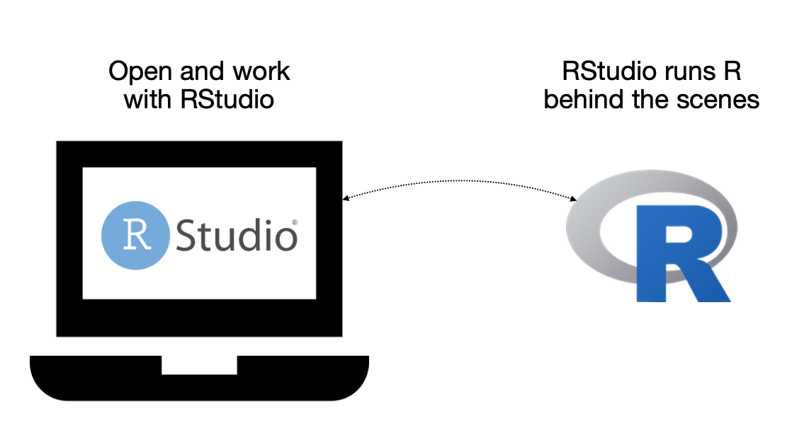
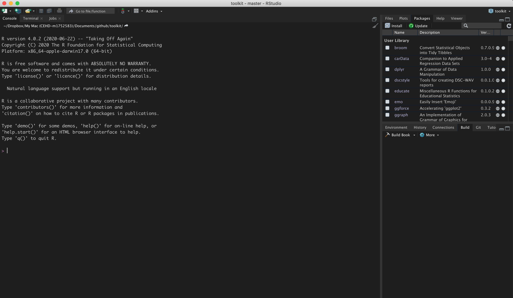
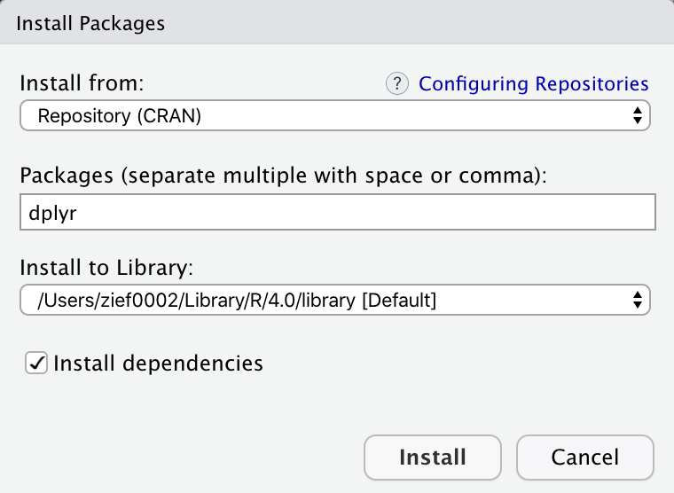

# Statistical Computation

```{r echo=FALSE, message=FALSE}
# Global options
options(
  tibble.pillar.subtle = FALSE, 
  tibble.pillar.sigfig = 7, 
  tibble.pillar.min_title_chars = 10,
  scipen = 5
  )

library(knitr)

# Chunk options
opts_chunk$set(
  # General
  comment = NA,
  message = FALSE, 
  warning = FALSE,
  tidy = FALSE,
  
  # Figures
  fig.align = 'center',
  fig.height = 6,
  fig.width = 6,  
  out.width = '50%' 
  
  
  )
```


The first set of tools we will discuss will be related to statistical computation. Specifically, I am going to focus on R and RStudio here. R is a free software environment for statistical computing and graphics. It can be installed on a variety of operating systems, including the MacOS, Windows, and UNIX platforms. RStudio is an open-source front-end^[Specifically, RStudio is branded as an "integrated development environment (IDE) [that] includes a console, syntax-highlighting editor that supports direct code execution, as well as tools for plotting, history, debugging and workspace management."] to running R that makes it easier to work with and compute with R.

Although you will need to install both R and RStudio, once they are installed you will only interact with RStudio when you compute.

```{r echo=FALSE, out.width="60%", fig.cap="Workflow for using R: Once both appplications are installed on you computer, you will only interact with R through RStudio."}

```


<br /><br />

## Installing R and RStudio

The next sections will walk you through the installation of R and RStudio. The process will be to install R first, and then install RStudio.

<br /><br />

### Installing R

To install R, navigate your web browser to:

<p style="margin-left:auto; margin-right:auto;">https://www.r-project.org/</p>

Then,

- Click the `CRAN` link under `Download` on the left-hand side of the page.
- Select a mirror site. These should all be the same, but I tend to choose the `Iowa State University` link under `USA`.^[When internet used to be dial-up (i.e., super slow, you wanted to choose a mirror site  that was closest in proximity to your location as it sped up the download. This is less of a concern now that internet download speeds are much faster.]
- In the `Download and Install R` box, choose the binary that matches the operating system (OS) for your computer.

This is where the installation directions diverge depending on your OS.

**Mac Instructions**

So long as you are running MacOS 10.13 or higher just click the first link for the PKG, which will download the installer for the most current version of R (4.0.2 as of July 24, 2020). Once the download completes, open the installer and follow the directions to install R on your computer.

If you are running an older version of MacOS, click the `el-capitan/base` link (near the bottom of the page) and then select the PKG link for R 3.6.3. Once the download completes, open the installer and follow the directions to install R on your computer.

If you are unsure which version of the MacOS is running on your computer, select `About this Mac` from the Apple menu in your toolbar. 


**Windows Instructions**

Click the link that says `Install R for the first time` (or click `base`; they go to the same place). Then click the `Download R 4.0.2 for Windows` link, which will download the installer for the most current version of R (4.0.2 as of July 24, 2020). Once the download completes, open the installer and follow the directions to install R on your computer.

**Linux Instructions**

If you are running Linux, you should know how to install things on your computer. `r emo::ji("happy")`


<br /><br />


### Installing RStudio Desktop


After you have installed R, you next need to install RStudio. To do this, navigate your web browser to:

<p style="margin-left:auto; margin-right:auto;">https://rstudio.com/products/rstudio/download/</p>

Then,

- Select the blue `Download` button under the free, open-source version of RStudio Desktop.
- Select the installer associated with your computer's OS.
- Once the download completes, open the installer and follow the directions to install RStudio Desktop on your computer.

<br /><br />


### Checking that Things Worked

From your Applications or Programs folder, open RStudio. If you have successfully downloaded both programs, this should open the application and you should see a message indicating that you are using "R version 4.0.2" in the console pane.

```{r echo=FALSE, out.width="100%", fig.cap="Once you open RStudio, you should see a message indicating that you are using `R version 4.0.2` in the console pane. Here the console pane is on the left-side, but it may be in a different location for you. Your RStudio may also have a white background rather than the black background seen here."}

```

<br /><br />


## Customizing RStudio

While the information in this section is not crucial for making things work, it is useful to get RStudio looking good and setting some default settings. Open the `Tools > Options` menu (Windows) or `RStudio > Preferences` (Mac). 

```{r echo=FALSE, out.width="50%", fig.cap="The RStudio options/preferences menu has many settings to customize RStudio."}
knitr::include_graphics("figs/06-options.png")
```


- In the `General` settings (`Basic`), change the option on "Save workspace to .Rdata on exit" to be "Never". Click the "Apply" button.
- In the `Appearance` settings, customize the look of RStudio to something aesthetically appealing to you. When you are finished, click the "Apply" button.
- There are also options you can set in the `Accessibility` settings if you use a screen reader. If you change anything, don't forget to click the "Apply" button.

When you are finished customizing RStudio, click the "OK" button.


<br /><br />


## Installing and Loading R Packages

Every R function is housed in a package (or library). You can see the packages  (and which version of each package) are installed by examining the `Packages` tab in RStudio.

```{r echo=FALSE, out.width="50%", fig.cap="Clicking the packages tab shows which packages are installed. The list of packages you have installed will likely be different. The version number is also shown."}
knitr::include_graphics("figs/03-package-tab.png")
```

Twenty-nine packages were included when you installed R on your computer. When you start an R session by opening RStudio, some of those packages are also loaded into memory. 

```{r echo=FALSE, out.width="70%", fig.cap="The 29 packages installed as part of R. The base, datasets, graphics, grDevices, methods, stats, and utils packages are loaded into memory when you start an R session. The other 22 packages are installed but not loaded into memory."}
knitr::include_graphics("figs/04-default-packages.png")
```

To load a package that you have installed, you use the `library()` function and include the name of the package you want to load in as the sole argument. For example, to load the grid package, use the following syntax:

```{r}
library(grid)
```

Some packages requires other packages (dependencies) to work. For example, the **survival** package is dependent on the **splines** package. When you load packages that have dependencies, R will also load the dependencies (assuming you have them installed). When it does this, a message will be printed after you execute `library()`. For example, here is what happens when we load the **survival** package.

```{r message=TRUE}
library(survival)
```

Once the package is loaded, all of the functions, data sets, etc. in that package are available to you. Packages will need to be loaded every time you launch a new R session. 

Sometimes you will get a message about objects being *masked*. This is not a problem. It is just informative and means that the  package you just loaded has a function that has the *exact same name* as a previously loaded package. If you use that particular function, the most recently loaded package's version of the function will be used.

<br /><br />

### Adding Functionality: Installing Packages

You can also install other packages onto your R system. R, in fact, has a repository called CRAN^["CRAN is a network of ftp and web servers around the world that store identical, up-to-date, versions of code and documentation for R."], that includes 16,000 different packages (as of July 2020). The easiest way to install a package from CRAN onto your computer is to use the `Install` button in the `Packages tab of RStudio.

This will open a pop-up window where you can type the CRAN package you want to install in a text box. Ensure that the "Install dependencies" box is checked (this will also install any package dependencies), and then click "Install".  

```{r echo=FALSE, out.width="50%", fig.cap="Pop-up window to install packages. Here we are installing the dplyr package. Note that the 'Install dependencies' box is checked."}

```

You may be prompted to choose a nearest mirror. If so, choose a mirror location. If you are successful in installing the package, you will get a message like the following:

```
Installing package into ‘/Users/zief0002/Library/R/4.0/library’
(as ‘lib’ is unspecified)
trying URL 'https://cran.rstudio.com/bin/macosx/contrib/4.0/dplyr_1.0.0.tgz'
Content type 'application/x-gzip' length 1209135 bytes (1.2 MB)
==================================================
downloaded 1.2 MB


The downloaded binary packages are in
	/var/folders/s3/sqlc9xw92w54166w86dgkd000000gr/T//Rtmps80Uf8/downloaded_packages
```

The message you get on Windows may be slightly different, but the key is that there is not an error. Furthermore, you should immediately be able to load the package using the `library()` function.

An equivalent manner of installing a package via syntax is to use the `install.packages()` function. For example, to install the **dplyr** package we could have used the following syntax:

```{r eval=FALSE}
install.pacckages("dplyr", dependencies = TRUE)
```

Note that the name of the package is included in quotation marks (it is a character string). The argument `dependencies=TRUE` installs all package dependencies, similar to checking the "Install dependencies" box in the pop-up menu.

<br /><br />


#### Installing Packages from GitHub

CRAN is not the only place to get R packages. Many developers add packages to a website called [GitHub](https://github.com/). Packages hosted on GitHub can be installed using the `install_github()` function from the **remotes** package.

First, you will need to install the **remotes** package from CRAN and then load it using the `library()` function. Then, you can use the `install_github()` function to actually install the package. This function is provided a character string that specifies the user name and GitHub repository for the package, separated by a slash. You can find this in the part of the URL that follows "https://github.com/" in your web browser. For example, the URL for the **educate** package is: "https://github.com/zief0002/educate", so to install this we would use:

```{r eval=FALSE}
# Load remotes package
library(remotes)

# Install dplyr from GitHub
install_github("zief0002/educate")
```

The message I get when installing this is

```
Installing package into ‘/Users/zief0002/Library/R/4.0/library’
(as ‘lib’ is unspecified)
* installing *source* package ‘educate’ ...
** using staged installation
** R
** inst
** byte-compile and prepare package for lazy loading
** help
*** installing help indices
*** copying figures
** building package indices
** installing vignettes
** testing if installed package can be loaded from temporary location
** testing if installed package can be loaded from final location
** testing if installed package keeps a record of temporary installation path
* DONE (educate)
```

The "DONE" message typically signified successful installation. Note that you may be prompted to update some packages. If you get this message, choose the option to update "ALL" packages. As with packages installed from CRAN, if things worked you should be able to load the package you just installed using the `library()` function without any errors.

<br /><br />


### Install Rtools/Command Line Tools

You may need to install some additional functionality to your system in order to get certain packages to install properly. On a Windows machine, you might need to install *Rtools*. Mac users might need to add the *Command Line Tools*. These tools also allow you to write and compile your own R packages. RStudio has well written instructions for adding these tools at: https://support.rstudio.com/hc/en-us/articles/200486498-Package-Development-Prerequisites.


<br /><br />