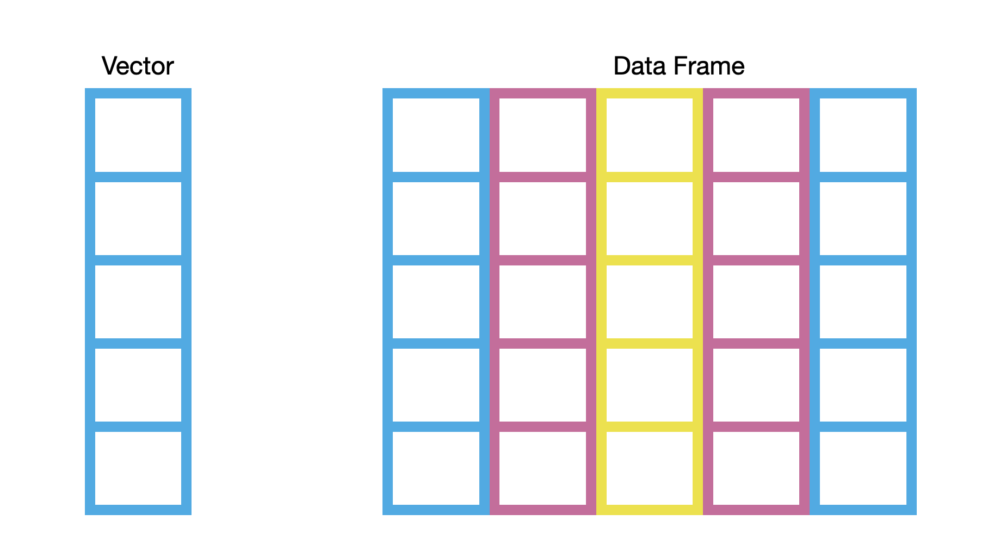

# Data Wrangling with dplyr {#dplyr}

```{r echo=FALSE, message=FALSE}
# Global options
options(
  tibble.pillar.subtle = FALSE, 
  tibble.pillar.sigfig = 7, 
  tibble.pillar.min_title_chars = 10,
  scipen = 5
  )

library(knitr)
library(kableExtra)

# Chunk options
opts_chunk$set(
  # General
  comment = NA,
  message = FALSE, 
  warning = FALSE,
  tidy = FALSE,
  
  # Figures
  fig.align = 'center',
  fig.height = 6,
  fig.width = 6,  
  out.width = '50%' 
  
  
  )
```


In this chapter, you will be learn about how to use functionality from the **dplyr** package to wrangle your data. Data wrangling is the catchall phrase that includes the processes of cleaning, structuring, and summarizing your data. It is a skill that every educational scientist needs to have in their computational toolkit! 

We will use the [riverview.csv](https://raw.githubusercontent.com/zief0002/modeling/master/data/riverview.csv) data to illustrate several data wrangling ideas. The data contain five attributes collected from a random sample of $n=32$ employees working for the city of Riverview, a hypothetical midwestern city (see the [data codebook](http://zief0002.github.io/epsy-8251/codebooks/riverview.html)). To begin, we will load several libraries and import the data into an object called `city`.

```{r warning=FALSE, message=FALSE}
# Load libraries
library(dplyr)
library(readr)

# Read in data
city = read_csv(file = "https://raw.githubusercontent.com/zief0002/modeling/master/data/riverview.csv")
head(city)
```

<br /><br />


## Piping: The Key to Using dplyr

Recall that functions work by taking arguments as inputs and then producing an output. For example, the `summary()` function takes the `city` data frame as its input.

```{r}
summary(city)
```

We could get the same result by using the piping operator (`%>%`). This operator takes a DATA FRAME (given immediately before the operator) and uses it as the FIRST argument in the function that comes immediately after the operator.


```{r}
# The pipe operator makes city the first argument of the summary function
city %>% summary()
```

Note since the `summary()` function did NOT include any additional arguments, we do not include anything between the parentheses after we pipe. Here is another example that illustrate the use of the pipe operator.

```{r}
# Count number of rows in city data frame
nrow(city)

# Can be written using the pipe operator as...
city %>% nrow()
```

The `filter()` function from the **dplyr** package is used to select certain rows from a data frame. For example, the syntax below selects all rows from the `city` data frame that have a `gender` value of `female`. To do this we provide a logical statement as the second argument to the `filter()` function.

```{r}
# Select the rows from city that have a gender value of "female" 
filter(city, gender == "female")

# Can be written using the pipe operator as...
city %>% filter(gender == "female")
```

Here, since the `filter()` function included a second argument, we include that argument in the function that the data frame is piped into. What is piped into the function, in this case `city`, will be automatically inputted into the FIRST argument.


<br /><br />


## Common dplyr Functions for Data Wrangling

Here are some common operations that researchers use to prepare data for analysis (i.e., data preparation, data wrangling, data cleaning) and the corresponding **dplyr** functions.

```{r echo=FALSE}
data.frame(
  operation = c(
    "Select a subset of rows from a data frame.",
    "Select a subset of columns from a data frame.",
    "Add new columns to a data frame.",
    "Sort and re-order data in a data frame.",
    "Compute summaries of columns in a data frame.",
    "Group the data to carry out computations for each group."
  ),
  computation = c("`filter()`", "`select()`", "`mutate()`", "`arrange()`", "`summarize()`", "`group_by()`")
) %>%
  kable(
    format = "html",
    caption = "Common data wrangling activities and the corresponding **dplyr** function.",
    col.names = c("Data wrangling activity", "dplyr function"),
    align = c("l", "l"),
    table.attr = "style='width:60%;'"
  ) %>%
  kable_styling() %>%
  row_spec(row = 0, align = "c")
```

<br /><br />


## Select a Subset of Rows: Filtering

To select a subset of rows, we will pipe the data frame we want to select rows from into the `filter()` function. The argument(s) for this function are logical expressions that will be used to select the rows. 

```{r}
# Select the female employees
city %>% 
  filter(gender == "female")
```

Here we are selecting only the rows where the gender variable is equal to (`==`) the character string "female". Recall that a single equals sign (`=`) is the assignment operator and that to say "is equal to", we need to use two equals signs (`==`).

:::protip
It is a good coding practice to use multiple lines when you are piping rather than putting all the syntax on a single line. When you do this, the pipe operator (`%>%`) needs to come at the end of the line. For example, in the code above, the pip operator is at the end of the first line of syntax rather than at the beginning of the second line of syntax. Include a line break after every pipe operator you use. 
:::

Note that the output from this computation (the rows of female employees) is only printed to the screen. If you want to keep the filtered data or operate on it further, you need to assign the output into an object.

```{r}
# Filter the female employees
female_employees = city %>% 
  filter(gender == "female")

# Count the number of rows (females)
nrow(female_employees)
```

We could have found the same result exclusively using piping; without the interim assignment.

```{r}
city %>% 
  filter(gender == "female") %>%
  nrow()
```

The first pipe operator uses the `city` data frame in the `filter()` function to select the female employees. This output (only the female employees) is then used in the `nrow()` function to count the number of rows. At is akin to a constant pipeline of chaining functions together; the output of a computation is used as the input into the next computation in the pipeline.

Here we use `filter()` to select the employees that have less than a high school level of education and then summarize all of the columns using the `summary()` function.

```{r}
city %>% 
  filter(education < 12) %>%
  summary()
```

<br /><br />


### Filtering on Multiple Attributes

You can filter on multiple attributes by including more than one logical statement in the `filter()` function. For example, the syntax below counts the number of female employees with less than a high school level of education.

```{r}
city %>% 
  filter(gender == "female", education < 12) %>%
  nrow()
```

Here, when we included multiple logical expressions in the `filter()` function, separated by a comma, they were linked using the AND (`&`) operator. This means that both expressions have to evaluate as `TRUE` to be included. We could also have explicitly used the `&` operator to link the two statements.

```{r eval=FALSE}
city %>% 
  filter(gender == "female", education < 12)

# Is equivalent to...
city %>% 
  filter(gender == "female" & education < 12)
```

We can also `filter()` using the OR (`|`) operator. This means that if EITHER expression evaluates as TRUE it is included.

```{r}
city %>% 
  filter(gender == "female" | education < 12)
```

This syntax would select any employee that is either female OR has an education less than 12 years.

<br /><br />


## Selecting a Subset and Renaming Columns

To select a subset of columns, we will use the `select()` function. The argument(s) for this function are the column names of the data frame that you want to select. For example, to select the `education`, `income`, and `gender` columns from the `city` data frame we would use the following syntax:

```{r}
city %>% 
  select(education, income, gender)
```

There are a number of helper functions you can use within the `select()` function. For example, `starts_with()`, `ends_with()`, and `contains()`. These let you quickly match larger blocks of columns that meet some criterion. The syntax below selects all the columns that have a column name that ends in 'e'.


```{r}
city %>% 
  select(ends_with("e"))
```


<br /><br />


### Renaming Columns

You can rename a column by using the `rename()` function. Here we select the `education`, `income`, and `gender` columns from the `city` data frame and then rename the `education` column to `educ`. Note that this works similar to assignment in that the new column name is to the left of the equal sign.

```{r}
city %>% 
  select(education, income, gender) %>%
  rename(educ = education)
```

<br /><br />


## Create New Columns: Mutating

To create new columns, we will use the `mutate()` function. Here we create a new column called `income2` based on multiplying the original `income` column by 1000.

```{r}
city %>% 
  mutate(
    income2 = income * 1000
    )
```

Depending on your print options, the results in `income2` may be in scientific notation. For example `3.74e+04` is equivalent to $3.74 \times 10^4=37400$.

:::protip
You can "turn off" scientific notation by running the following syntax in your R session:

```{r eval=FALSE}
options(scipen = 99)
```

You will need to run this syntax every R session.
:::


You can create multiple new columns within the same `mutate()` function. Simply include each new column as an argument. Below we again create `income2`, but we also additionally create `cent_educ` which computes the difference between each employee's education level and the mean education level.

```{r}
city %>% 
  mutate(
    income2 = income * 1000,
    cent_educ = education - mean(education)
    )
```

<br /><br />


## Sorting the Data: Arranging

The `arrange()` function sorts the data based on the values within one or more specified columns. The data is ordered based on the column name provided in the argument(s). The syntax below sorts the rows in the `city` data frame from smallest to largest income.

```{r}
city %>% 
  arrange(income)
```

Providing the `arrange()` function multiple arguments sort initially by the column name given in first argument, and then by the columns given in subsequent arguments. Here the data are sorted first by gender (alphabetically since `gender` is a character string) and then by income (lowest to highest).

```{r}
city %>% 
  arrange(gender, income)
```

Use the `desc()` function on a column name to sort the data in descending order. Here the data are sorted first by gender (alphabetically since `gender` is a character string) and then by income. Here the data are sorted first by gender (alphabetically) and then by income (highest to lowest).

```{r}
city %>% 
  arrange(gender, desc(income))
```

<br /><br />


## Computing Summaries of Data in a Column

The `summarize()` function is used to compute summaries of data in a given column. Here we compute the mean income for all the employees.

```{r}
city %>% 
  summarize(
    M = mean(income)
    )
```

The output from `summarize()` is a data frame with a single row and one or more columns, depending on how many summaries you computed. Here we computed a single summary so there is only one column. We also named the column `M` within the `summarize()` function.

Multiple summaries can be computed by providing more than one argument to the `summarize()` function. The output is still a single row data frame, but now there will be multiple columns, one for each summary computation. Here we compute the mean income for all the employees and the standard deviation of the incomes.

```{r}
city %>% 
  summarize(
    M  = mean(income),
    SD = sd(income)
    )
```

<br /><br />


## Computations on Groups

The `group_by()` function groups the data by a specified variable. By itself, this function essentially does nothing. But it is powerful when the grouped output is piped to other functions, such as `summarize()`. Here we use `group_by(gender)` to compute the mean income and the standard deviation of the incomes for both males and females.

```{r}
city %>% 
  group_by(gender) %>%
  summarize(
    M  = mean(income),
    SD = sd(income)
    )
```

You can also use `group_by()` with multiple attributes. Simply add additional column names in the `group_by()` function to create more conditional groups. For example to compute the mean income and standard deviation for males and females conditioned on political party, we can use the following syntax.

```{r}
city %>% 
  group_by(gender, party) %>%
  summarize(
    M  = mean(income),
    SD = sd(income)
    )
```

This produces the summary measures for each of the combinations of the levels of gender and political affiliation in the data.

<br /><br />


<!-- ```{r echo=FALSE, out.width="60%", fig.cap="LEFT: A visual mnemonic for a vector is a single-column bookcase. RIGHT: A visual mnemonic for a data frame is a multi-column bookcase."} -->
<!--  -->
<!-- ``` -->

